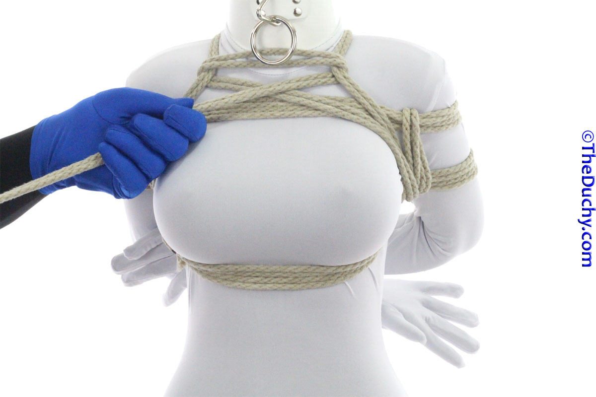

## [TK Mt. Fuji - Gote Shibari - TheDuchy](https://www.theduchy.com/gote-shibari/#mt-fuji-3tk)

-  1. This variant begins in a slightly different place than the other 3TKs. Instead of locking off your Kannuki, to the center line, begin this immediately after bringing the tail through the arm after your last Kannuki.
-  2. …and lock it off with a Crossing Hitch directly to the back of the lower strap. To begin, run the tail up
-  3. Reach under the strap with your fingers on the side of the tail closer to the center line.. In order to have the Crossing Hitches facing the right way so that the tension tends to keep them closed and locked, always start them this way–with your fingers on the side of the rope closer to the center line/core of your partner’s body.
-  4. Now put your fingers under the strap on the opposite side of the knot
-  5. Grab the tail…
-  6. …and pull it through
-  7. Repeat this procedure to put a second Crossing Hitch on the next strap up
-  8. This one will be a little closer to the center line. We will be running the tail over the opposite shoulder, so it generally follows that path
-  9. Run the tail over the opposite shoulder
-  10. …then straight down, on the inside of the Kannuki. Then begin running the tail around your partner’s back under the arms…
-  11. …across the lower back–between the wrist and the back–to the other side
-  12. …to the other side. Be sure to pull it tight so that it slips between your partner’s wrists and back and comes up to run parallel right next to the lines of the lower Kannuki. You can see the line we are working with as the lowest of the horizontal ropes on my partner’s back in this picture
-  13. You might need to help the line get up where it needs to be, no worries
-  14. Now run the tail up on the inside of the Kannuki up to the shoulder
-  15. Run the tail to the back, crossing the other shoulder strap. Place you fingers under the strap on the side closest to your partner’s core. Grab the tail
-  16. Lay the tail over the incoming line
-  17. …and then under the crossing line to form another Crossing Hitch
-  18. Add another Crossing Hitch to lock down the upper strap. If you like symmetry, you can use a Reverse Crossing Hitch here. It will then mirror the other side. I provide details on creating the Reverse Crossing Hitch in the X3TK section.
-  19. Lock the tail to the lower strap with another Crossing Hitch
-  20. Reach under between the arm and body from the front and grab the tail
-  21. Pull the tail through and begin running it across the chest
-  22. Reach under the opposite shoulder strap and grab the tail
-  23. Pull it through
-  24. Reverse the tension and run it to the other shoulder strap
-  25. Reach under the shoulder strap from the chest side. Grab the tail
-  26. Pull through and add some tension. This will pull the shoulder straps away from the shoulders a little, making them more comfortable and pulling them away from the nerves that run there.
-  27. Some riggers leave the ropes simply crossed here…
-  28. But many like to add a little twist here. …makes it look a little more like the top of a volcano… a la Mt Fuji…
-  29. Bring the tail to the back on the inside of the Kannuki
-  30. Bring the tail under the center line…
-  31. … so that all the lines from the Kannuki and the Mt Fuji are on the same side of the center line
-  32. And from here lock off with a Square Friction. Reverse tension…
-  33. …Under
-  34. …Over…Under
-  35. Pull tightly until the friction is very solid
-  36. Now tie it off. I have about 12″ (30cm) of rope left, so I chose to run it over the center line and under the right-hand side of the Kannuki strap again, and then I wrapped one strand around and around the lower strap and then tucked the ends between the strands of the lower strap to lock it off….
-  37. Then I brought the other strand to the other side…
-  38. …and did the same thing over here
-  39. Competed Mt Fuji 3TK from the back
-  40. …and from the front.

